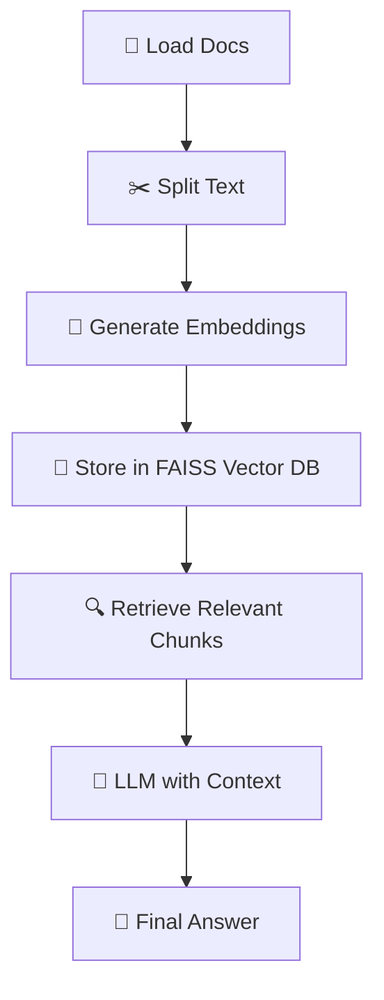

# 🔍 RAG_langchain – Modular RAG Pipeline with LangChain + Ollama

A production-ready, modular Retrieval-Augmented Generation (RAG) system built using **LangChain**, integrated with **local Ollama models** (`llama2`, `tinyllama`). This version supports embedding-based semantic search, flexible caching, and custom data pipelines.

---

## 🧠 What is RAG?

**Retrieval-Augmented Generation (RAG)** is a method that improves the factual accuracy of language models by augmenting their input with relevant documents retrieved from a knowledge base. This project implements RAG using:

- 📁 Local Markdown/Text files as the knowledge base
- 🔍 FAISS vector store for fast semantic search
- 🤖 Ollama for running local LLMs like `llama2`

---

## 🏗️ Modular Tech Stack

| Component            | Implementation                             |
|----------------------|---------------------------------------------|
| 📄 Document Loader   | `DirectoryLoader` via `data_loader.py`      |
| ✂️ Text Splitter     | `RecursiveCharacterTextSplitter`            |
| 🧠 Embeddings        | `HuggingFaceEmbeddings` (local)             |
| 💾 Vector Store      | `FAISS` stored locally                      |
| 💬 LLM               | `llama2` via `Ollama`                       |
| 🔗 RAG Pipeline      | `RetrievalQA` in `rag_pipeline.py`          |
| 🧹 Cache Management  | `cache.py`, `cache_cleaner.py`, `file_tracker.py` |

---

## 🔁 Workflow Overview



---

## 🚀 Getting Started

1. **Install Dependencies**
    ```bash
    pip install -r requirements.txt
    ```

2. **Start Ollama (LLM must be downloaded)**
    ```bash
    ollama run llama2
    ```
    You can also try tinyllama for faster responses:
    ```bash
    ollama run tinyllama
    ```

3. **Run the Main Pipeline**
    ```bash
    python main.py
    ```

---

## 📁 Directory Structure

```
RAG_langchain/
│
├── main.py                 # Entry point script
├── config.py               # Central configuration for paths, model names, etc.
├── data_loader.py          # Loads and splits documents
├── embedder.py             # Embedding generation using HuggingFace
├── vectorstore.py          # Handles FAISS DB creation & queries
├── rag_pipeline.py         # Assembles the RetrievalQA chain
├── cache.py                # Query/result caching
├── cache_cleaner.py        # Optional tool to clean cache
├── file_tracker.py         # Tracks processed files
├── query_cache.json        # Stores cached responses
├── requirements.txt        # Python dependencies
└── readme.md               # You're here!
```

---

## 🔄 Caching System

To avoid redundant processing and speed up dev cycles:

- ✅ Embedding cache
- ✅ Query result cache (`query_cache.json`)
- ✅ File change detection (`file_tracker.py`)

To clear the cache manually:

```bash
python cache_cleaner.py
```

---

## ⚠️ Notes on LangChain Deprecations

LangChain v1.0+ deprecates many older modules. Update your imports as follows:

| Old Module                    | New Module                                 |
|-------------------------------|--------------------------------------------|
| `langchain.vectorstores`      | `langchain_community.vectorstores`         |
| `langchain.embeddings`        | `langchain_huggingface.embeddings`         |
| `langchain.llms`              | `langchain_ollama.llms`                    |

---

## ✅ Benefits

- 🔧 Modular architecture – swap loaders, vector stores, or LLMs easily
- 🔍 Semantic search – better accuracy for factual questions
- 💻 Local execution – no external API calls
- 🛠️ Customizable – extend with agents, tools, tracing

---

## ❌ Limitations

- 🧠 Local LLMs like llama2 may not match GPT-4 level reasoning
- 🐢 Larger models require more RAM/VRAM
- 🧪 Some components will need updating in future LangChain versions

---

## 🙋‍♂️ Example Usage

```python
# Example question to the pipeline
Question: "What is the purpose of FAISS in the pipeline?"

# LLM Answer:
"FAISS is used to store and retrieve text chunks based on their semantic similarity. It enables fast vector search over embedded document chunks."
```

---

## 📬 Contributions

PRs and suggestions welcome! Feel free to fork and submit a pull request.

---

## 📄 License

MIT License – use freely and responsibly.

---

Let me know if you'd like badges, diagrams, or a version with advanced features (e.g., multiple retrievers, GUI integration).

