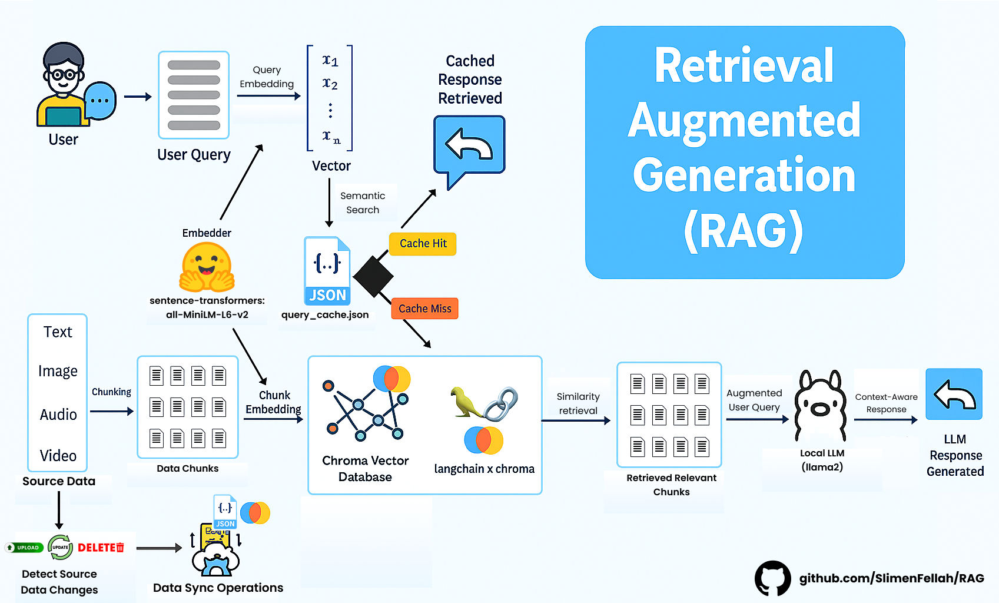

# RAG Systems Exploration

This repository documents my journey in building Retrieval-Augmented Generation (RAG) systems, starting from simple implementations and progressing to more complex architectures. The goal is to experiment, learn, and share insights about RAG techniques and their applications.



## Contents

- Step-by-step RAG system implementations
- Explanations and documentation for each stage
- Example use cases and experiments

## Getting Started

1. **Clone the repository.**
   ```bash
   git clone https://github.com/SlimenFellah/RAG.git
   ```
2. **Install and run Ollama with Llama 2:**
    - Download and install Ollama from [https://ollama.com/download](https://ollama.com/download).
    - After installation, open a terminal and run:
      ```sh
      ollama pull llama2
      ```
    - Start the Ollama server (if not already running):
      ```sh
      ollama serve
      ```
    - This will make the Llama 2 model available locally for all RAG experiments in this repository.
3. **Follow the instructions in each section to explore different RAG setups.**

## About

This repo is intended for learning and experimentation with RAG systems, showcasing the evolution from basic to advanced solutions.

## Contributing

Contributions are welcome! If you have ideas, improvements, or bug fixes, feel free to open a pull request. You can also raise issues or check existing ones in the [Issues](https://github.com/SlimenFellah/RAG/issues) section to help improve the project.

## License

This project is licensed under the MIT License. See the [LICENSE](LICENSE) file for details.